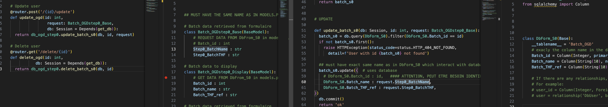

# step by step implementation :

1. create main.py and include router

2. make folder router and add db_n.py python file for each db table 

3. go to db_n.py and create fastapi route (it needs a pydantic display)

4. make shemas.py file at the root and create pydantic model to transfer info (passe plat)
    1 depuis l'user (formulaire) vers la db -- BatchBase 
    2 depuis la db vers l'interface user -- BatchDisplay

5. go to db_n.py and ceate the route (it needs connection to db)

6. create database folder : create db_connect.py to create connexion to database 
    set environ variable USER PASS NAME for the DB

7. go to db_n.py and ceate the route (it needs a function to make the call to the db)

8. create in database folder : the db_ogd_step1.py and write SQL logic in functions (CRUDE)
    it need the table definition

9. create in database folder : the models.py and define tables structures in class

10. go to db_n.py and ceate the variable requesting all the parameters 

##### DOCUMENTER LES ERREUR ET LEUR RESOLUTION

sqlalchemy.exc.ProgrammingError: (mysql.connector.errors.ProgrammingError) 1054 (42S22): Unknown column 'Etape1_lancement.Observation' in 'field list'
[SQL: SELECT ...
FROM `Etape1_lancement`]
(Background on this error at: https://sqlalche.me/e/20/f405)

--> Le nom dec colonne dans models.py doit etre exactement le meme que celui dans la BDD
==> changer le nom de colonne

 {'type': 'missing', 'loc': ('response', 320, 'Step1_Date'), 'msg': 'Field required', 'input': <database.models.DbForm_S1 object at 0x1116c3d90>}
  {'type': 'missing', 'loc': ('response', 320, 'Step1_Initiales'), 'msg': 'Field required', 'input': <database.models.DbForm_S1 object at 0x1116c3d90>}

  --> Le form dans shemas.py qui recoit les info de la bdd (Batch_OGDStep1_Display) doit avoir le meme nom de variable que dans la bdd
  ==> changer nom variable dans shemas.py (display)

    {'type': 'string_type', 'loc': ('response', 320, 'Batch_id'), 'msg': 'Input should be a valid string', 'input': 341}

--> le form (DIsplay vérifie le type de variable), si la bdd renvoie int, le form doit spécifier qu'il attend un int
==> ajuster nom + type de variable

  File "/Users/remicazelles/Documents/Travail/2024-CarbonWaters/ProjectSimplon/Carbon_Waters_Forms/fast_api_bdd/database/db_ogd_step1.py", line 56, in get_batch_s1
    batch_s1 = db.query(DbForm_S1).filter(DbForm_S1.Step1_id == id).first()
                                          ^^^^^^^^^^^^^^^^^^
AttributeError: type object 'DbForm_S1' has no attribute 'Step1_id'

--> in database, function used to interact with bdd should use variables from models.py (that defines the bdd table)
==> change Step1_id by the name of columns in bdd Batch_id

TypeError: 'Step1_id' is an invalid keyword argument for DbForm_S1

--> for create batch step1, we populate the form BdForm_S1 so 
==> we need to use agrments with same name as bdd in models.py

In 
try:
    db.add(new_batch)
    db.commit()
    db.refresh(new_batch)
    return new_batch
  
  except Exception as e :
    raise HTTPException(status_code=status.HTTP_409_CONFLICT,
                        detail="This batch already registered")

we get  Undocumented
	

Error: Conflict
Response body

{
  "detail": "This batch already registered"
}

if we change raise HTTPException by raise e
we get 
Incorrect datetime value: 'string' for column 'Date' 

--> in shemas the Batch_OGDstep1_Base use to request the database doesnt have the same type as in the datatbase. we can keep different variibale name than in the db but we need the type to be the same

sqlalchemy.exc.DatabaseError: (mysql.connector.errors.DatabaseError) 1366 (HY000): Incorrect integer value: 'string' for column 'Technicien_id' at row 1

this is because technicien is a string as input from the formulaire but it is stored as an int for anonymisation in the BDD

### WORKFLOW
so we need:
1 : create db_techniciens in /database

2 : create Techniciens_router in /router

3 : create Technicien_Base/Display in shemas.py

4 : create DbForm_Technicien in models.py
    - same variable name as in BDD
    - same variable types as in BDD

5 : in shemas.py
    - create variable in Technicien_Base (schemas.py)
    - use same variables as in bdd for Technicien_Display (that will be populated by database)

6 : in Techniciens_router.py
    update the form to use

7 : in db_techniciens.py
    -create function that interact with bdd (CRUD) via templates in schemas.py

8 : in Techniciens_router.py
    - adjust the schemas that will be sent to functions interacting with db 
        + if send info, make sure type is the same as db
        + if retreive info make sure the variable name are same as in db

9 : in main.py add the new router 